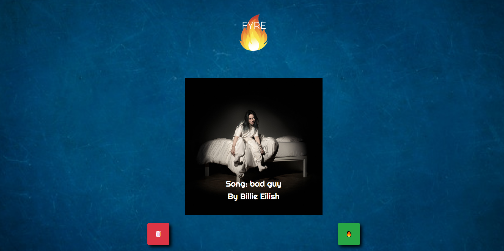

# Fyre
 
## Description: 

Fyre is hot new music application that allows users to discover their new favorite songs. Upon entering the user's Spotify login to verify credentials for our Spotify API, the user will be directed to our home page where a random playlist will begin playing 30 second previews of songs for the user. From there, the user can decide if the preview is "Fyre" by clicking the flame icon OR "Trash" by clicking the trash icon. Upon clicking the "Fyre" flame icon, the song shall be added into the users main playlist. On the playlist page, users can add or delete songs manually.

**Spotify Premium is required**.

## Table Of Contents:

1. How To Install
2. Usage
3. Technology Used / Badges
4. Contributors 
5. Tests
6. License

## How To Install

Access our application with our deployed link in your web browser: <https://fathomless-basin-76899.herokuapp.com/>

## Usage

Once you have decided on a song if it is "hot" or not, click on the "Fyre" icon to add to playlist or the trash icon to skip to the next song preview. Users can click "View Playlist" to be directed to their saved playlist of all the song's they have deemed "Fyre."

## Technologies Used / Badges
      

## Contributors

[Trion Bailey](https://github.com/trionb), [Ethan Lacy](https://github.com/Ethanl150), [Chris Lee](https://github.com/cil5345), [Long Nguyen](https://github.com/LNguyen95uzi)

## Tests

None

## License

ISC License (ISC)
Copyright <2020> (Trion Baily, Ethan Lacy, Chris Lee, Long Nguyen)

Permission to use, copy, modify, and/or distribute this software for any purpose with or without fee is hereby granted, provided that the above copyright notice and this permission notice appear in all copies.

THE SOFTWARE IS PROVIDED "AS IS" AND THE AUTHOR DISCLAIMS ALL WARRANTIES WITH REGARD TO THIS SOFTWARE INCLUDING ALL IMPLIED WARRANTIES OF MERCHANTABILITY AND FITNESS. IN NO EVENT SHALL THE AUTHOR BE LIABLE FOR ANY SPECIAL, DIRECT, INDIRECT, OR CONSEQUENTIAL DAMAGES OR ANY DAMAGES WHATSOEVER RESULTING FROM LOSS OF USE, DATA OR PROFITS, WHETHER IN AN ACTION OF CONTRACT, NEGLIGENCE OR OTHER TORTIOUS ACTION, ARISING OUT OF OR IN CONNECTION WITH THE USE OR PERFORMANCE OF THIS SOFTWARE.

